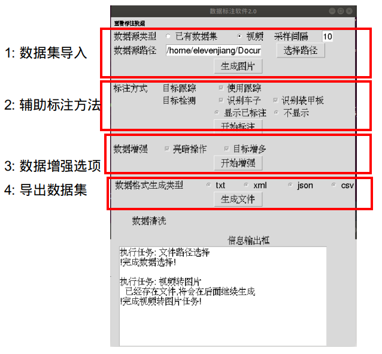

# 一 使用说明

## 1. 软件综述

本软件主要实现的功能有:

1. 使用GUI进行整体软件标注配置选择
2. 使用神经网络识别/自动跟踪的方法进行标注辅助
3. 使用BBOX增多进行数据增强
4. 支持多种数据集格式导出


## 2. 快速使用方案

> 快速使用主要是要使用软件中的视频转图片,BBOX增多,以及数据集导出,另外如果物体较近可以考虑使用目标跟踪
>
> 神经网络辅助标注需要在Annotation中完成MyDetector的实现从而有对应帮助的标注

### 2.1 环境配置

> 其他所需包遇到什么安装什么即可

```
torch                         1.2.0        
torchvision                   0.2.0    
numpy                         1.18.4   
opencv-python                 4.2.0.32     
opencv-contrib-python         4.2.0.32     
tqdm                          4.35.0 
matplotlib
albumentations
progress
```

完成安装后,执行GUI.py的代码,即可看到GUI界面




### 2.2 数据集导入

> 数据集导入可以选择已有数据集导入/视频导入.

快速使用中仅介绍使用视频导入的方法.

视频导入即选择对应拍摄的视频文件,指定视频采样间隔(默认10帧采样一次),点击生成图片即可.支持多条视频连续导入.导入后,Test1/dataset/images中会生成x.jpg


### 2.3 辅助标注方法

> 标注方法支持目标跟踪和目标检测,

- 快速使用中,因为没有神经网络训练集,同时为避免麻烦,也不进行目标跟踪

1. 选择目标跟踪,另外需要选择是否显示已标注内容(建议选上),点击开始标注,即可进行标注

2. 点击开始标注后,会出现labeled_image和image_detect save_image两个GUI界面,labeled_image显示已经标注过的数据image_detect save_image即负责进行标注

3. 选中image_detect save_image界面,键盘按w即可开始标注

     (选中界面采用opencv的selectROIs的操作方法)

     1. w键开启一个标注界面


## 3. 细节说明


# 二 改进需求

## 1. 需求

1. 所有需要使用到的包需要用一个新的python环境进行添加

2. 一些特殊环境需要实现的包,直接在对应位置进行生成

3. python包的路径如果缺少,需要自己完成配置

4. 生成CenterNet数据集的时候,数据集名称存在问题(但是这个不影响最终的识别)

     


## 2. 已完成更改

1. 更换了CenterNet的Backbone,变为了res18,从而方便进行识别

2. 添加了不使用任何辅助标注的方式,即重新定义了MyDetector中的内容

     这里面继承了新的类,从而不识别


# 三 存在问题

1. opencv-Contribute的为

     ```
     AttributeError: module 'cv2.cv2' has no attribute 'MultiTracker_create'
     ```

     这里面,需要使用opencv-contribute,如果出现此问题,可以重新安装opencv和opencv-contribute

     ```
     pip uninstall opencv-python opencv-contrib-python
     pip install opencv-python==4.2.0.32
     pip install opencv-contrib-python==4.2.0.32
     ```

     


